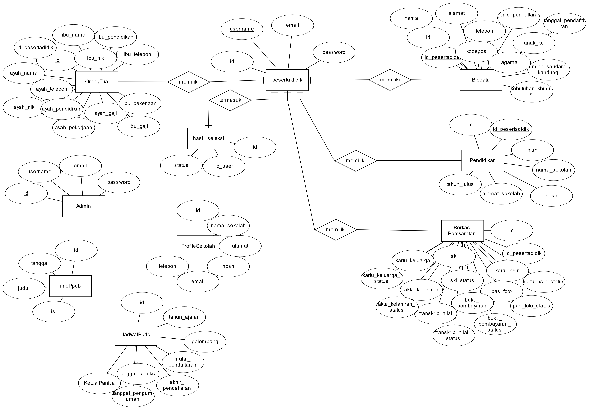

# CMS SISTEM PPDB SMP MA'ARIF KALIBAWANG

## Techstack

- PHP v8.x.x  
- Composer [official site](https://getcomposer.org)  
- CodeIgniter 4 [official site](https://codeigniter.com)  
- MySQL/MariaDB  (relational database)  

## Setup

- Copy `env` to `.env` and tailor for your app, specifically the baseURL and any database settings.  
- run `composer install`  
- Create database in MySQL (same as in `.env` file)  
- run database migration `php spark migrate --all`  
- run Seeder
  - `php spark db:seed CreateAdminAccount`  
  - `php spark db:seed InsertProfileSekolah`  
  - `php spark db:seed InsertJadwalPpdb`  

## Entity Relationship Diagram  

